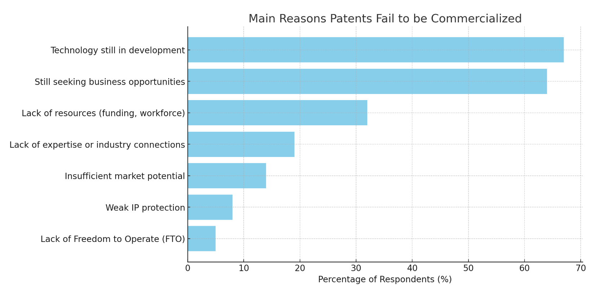

# 11363127 林士傑 2025/05/20
## 從學習到實踐的必經之路(完整心得報告)
**胡龍融 博士**

## 目錄
1. 前言
2. 技術轉產品與市場價值
3. 知識經濟與知識創業家
4. 產品開發流程與市場驗證
5. 產品/市場契合與新創發展
6. 結論
7. 參考文獻

---

## 1. 前言

隨著知識經濟時代來臨，創業者不僅要有技術與知識，更需懂得如何將技術轉化為具市場價值的產品。實務上，許多創業簡報都強調「市場驗證」、「用戶需求」以及「商業模式」的重要性。查詢了多篇文章，並結合實際創業常見的方法，探討從知識、技術到產品與商業化的關鍵歷程。

---

## 2. 技術轉產品與市場價值

許多創新發明最終無法成功，關鍵在於「技術」並不等於「市場價值」。一項新技術若要成為真正的創新，必須在市場中產生經濟效益。根據創業說明常見內容，團隊在技術轉產品時，會用「市場規模分析」、「目標客群」等來說明市場需求。現實中，許多發明無法商業化，原因包括缺乏明確市場需求、商業模式不明確、產業鏈未能配合等。因此，技術的轉化過程需結合市場需求與商業模式設計，才能創造出真正有價值的產品。
 

---

## 3. 知識經濟與知識創業家

知識經濟時代，知識與創新成為企業競爭力的核心。從許多創業簡報中可見，團隊會特別強調專利佈局、技術壁壘、團隊專業能力等，這些都屬於知識資本與無形資產的展現。企業不僅需保護知識產權（如著作權、專利等），更需培養高知識員工並激勵其創新。知識創業家透過知識積累、技術研發與資源整合，推動新事業發展。企業需建立良好的知識管理體系，將知識有效轉化為產品與服務，提升市場競爭力。

---

## 4. 產品開發流程與市場驗證

打造市場成功產品需經歷完整的產品開發流程，主要步驟包括：

- **市場分析**：透過市場調查了解用戶需求與競品狀況。
- **概念驗證**：用MVP（最小可行性產品）快速測試。
- **設計開發**：產品原型設計與功能開發。
- **測試優化**：反覆測試並根據反饋優化產品。
- **上市策略**：規劃產品上市時間與行銷推廣。

市場驗證（Market Validation）是關鍵環節，能有效降低創業風險，確保產品真正符合市場需求。

---

## 5. 產品/市場契合與新創發展

精實創業（Lean Startup）強調「產品/市場契合」（Product/Market Fit），即產品必須解決特定市場的真實需求。新創團隊常見挑戰包括：如何快速驗證市場、調整產品定位、找到適合的商業模式等。投資者也會重視新創團隊是否已達到產品/市場契合，這是企業成長的關鍵里程碑。

---

## 6. 結論

這次聽完 `胡龍融`博士 的演講，讓我很有感觸。雖然我一直對創業充滿熱情，但看完這些內容才真正體會到，創業遠比想像中困難。

不只是有技術或好點子就夠，從知識、技術到產品，再到真正變成有市場的生意，每一步都充滿挑戰。

最讓我印象深刻的是，「產品必須有市場」這句話，很多失敗其實不是技術不好，而是沒有人願意買單，或時機不對。

創業與產品開發是一條從知識、技術到產品、商業化的艱辛路徑。單靠技術或點子並不足夠，必須關注市場需求、產品開發流程、市場驗證與商業模式設計。

---

## 7. 參考文獻

1. [發明技術如何真正創造市場價值？論市場需求、商業模式和產業鏈](https://www.patent4q.com/post/%E5%BE%9E%E5%95%86%E6%A5%AD%E6%A8%A1%E5%BC%8F%E7%9C%8B%E7%99%BC%E6%98%8E%E5%A6%82%E4%BD%95%E5%89%B5%E9%80%A0%E5%83%B9%E5%80%BC)
2. [知識經濟與知識創業家 - 科技大觀園](https://scitechvista.nat.gov.tw/Article/c000003/detail?ID=adaff865-3df9-4653-b17e-d1152ac52a8a)
3. [產品開發流程解析打造市場爆款的秘訣](https://startcompany.tw/%E7%94%A2%E5%93%81%E9%96%8B%E7%99%BC%E6%B5%81%E7%A8%8B%E8%A7%A3%E6%9E%90-%E6%89%93%E9%80%A0%E5%B8%82%E5%A0%B4%E7%88%86%E6%AC%BE%E7%9A%84%E7%A7%98%E8%A8%A3/)
4. [產品/市場契合與新創發展歷程探討](http://www.airitifile.com/abc/P20221116052/9789576193439.pdf)

